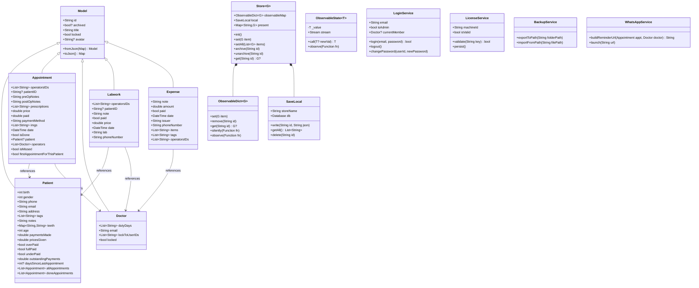
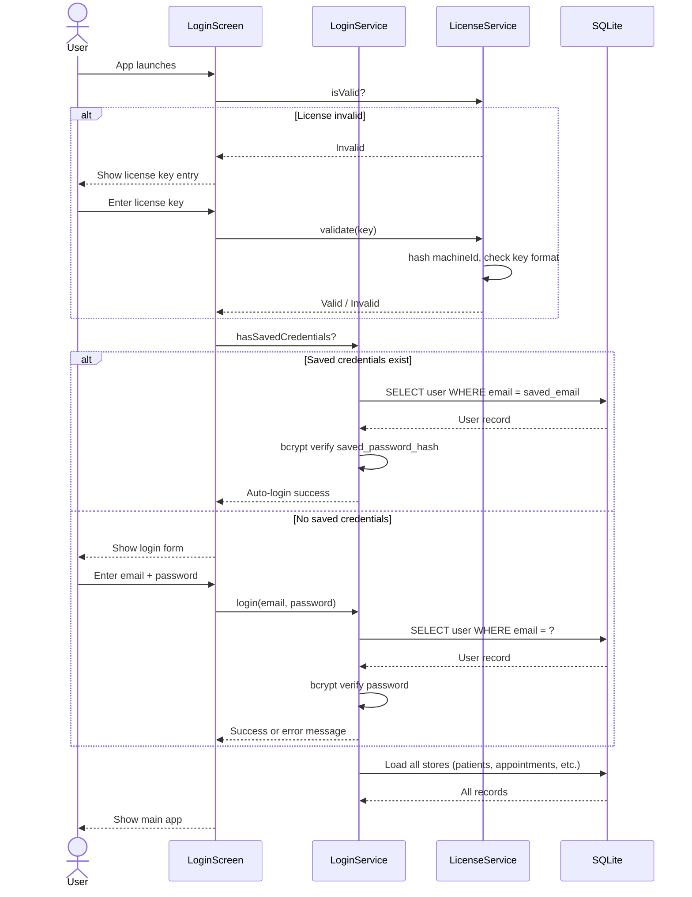
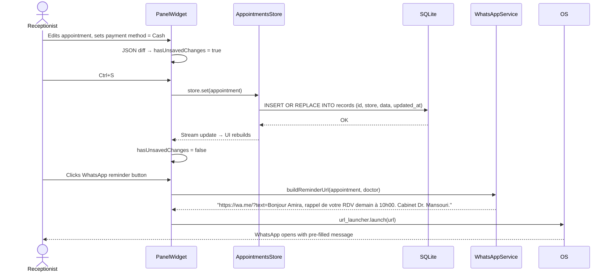
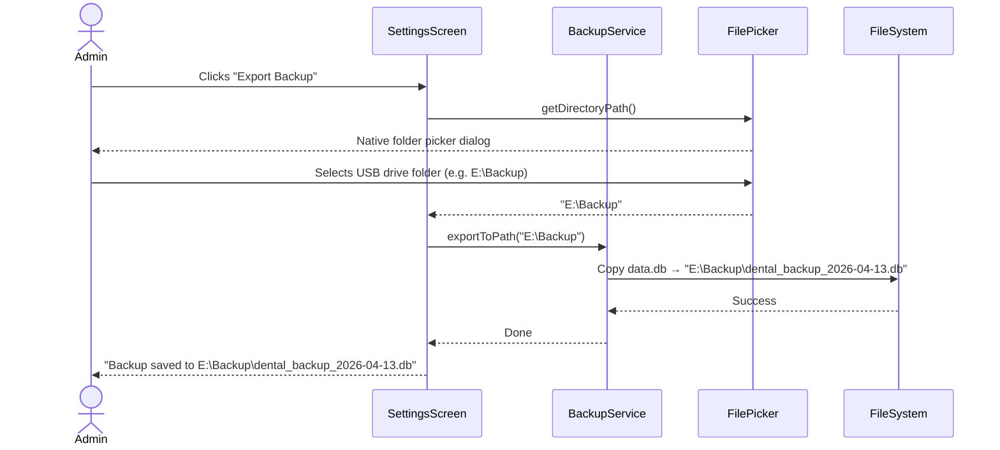
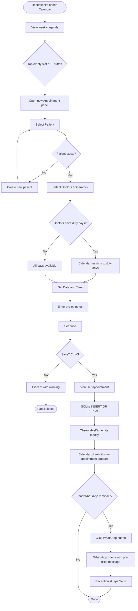

# Algeria Dental Clinic App — Technical Specification

*Adapted from Apexo v0.4.3 source analysis. This document describes the target product for Algerian private dental clinics — what to keep, what to cut, and what to build new.*

---

## 1. Executive Summary

A desktop-first dental clinic management system for Algerian private practices. Staff track patients, schedule appointments, manage lab work orders, record expenses, and review financial performance — all stored locally on the clinic's own Windows PC with no internet dependency, no cloud subscription, and no monthly fee. The clinic pays once, installs once, and owns their data. Backups go to a USB drive. The UI defaults to Arabic with French as the primary alternative. This is built on Flutter (Windows desktop), with local SQLite replacing all cloud infrastructure.

---

## 2. Full Feature List

### Authentication & Access

- Login with email + password (local auth, no server URL field)
- Local session persistence — auto-login on relaunch using saved credentials
- Admin vs. regular user roles with different access levels
- Per-module permission flags (6 boolean flags, configurable per-user by admin)
- Route locking based on permissions
- Doctor locking — a doctor can be restricted to specific user accounts
- Admin-only manual password reset (no email flow — admin sets a new password directly)
- One-time license key validation on first launch (tied to machine ID)
- First-launch setup wizard

### Patient Management

- Create, edit, archive patients
- Fields: name, date of birth, gender, phone, address, tags (multi-value), notes, dental chart (per-tooth status map)
- Email field present but optional — most patients won't have one
- Computed age from birth year
- Computed payment status (underpaid / fully paid / overpaid)
- Outstanding payment balance across all done appointments
- Days since last appointment
- Patient photo gallery (photos pulled from appointment images)
- Tag-based filtering
- Search and filter on data table
- One-click call (tel: URL launch — opens phone dialer or WhatsApp)
- WhatsApp reminder button — one click opens WhatsApp Web/app with a pre-filled message: "Bonjour [patient name], rappel de votre rendez-vous demain à [time]. Cabinet Dr. [name]." Receptionist reviews and hits send. No API, no automation.
- View all patient appointments in a side panel
- Archive/unarchive with toggle

### Appointment / Calendar Management

- Create, edit, archive appointments
- Fields: patient, operators (multi-doctor), date & time, pre-op notes, post-op notes, price, amount paid, payment method (Cash / CCP / BaridiMob), prescriptions (list), photos, done/not-done toggle
- Week-view calendar with day agenda
- Left/right swipe navigation by week
- Filter calendar by doctor
- Appointment status: upcoming, done, missed (past + not done)
- Missed appointment detection
- First appointment detection per patient (new patient tracking)
- Payment difference calculation (overpaid / underpaid / fully paid)
- Photo capture per appointment (multiple images, from file system on desktop)
- Prescription list entry and PDF printing
- Side panel with tabs: overview, patient info, operators, payment, notes, photos, prescriptions
- Archive toggle

### Doctor Management

- Create, edit, archive doctors
- Fields: name, email (optional), duty days (multi-select days of week), lock to specific user IDs
- Computed upcoming / past / done appointment counts per doctor
- Lock property based on user-to-doctor access restriction

### Lab Work Management

- Create, edit, archive lab work orders
- Fields: patient, operators, lab name, note, phone number, price, paid (boolean), date
- Auto-complete for lab name and phone number (based on history)
- Payment status tracking
- Lock-based access restriction

### Expense Tracking

- Create, edit, archive expenses
- Fields: issuer name, note, amount, paid (boolean), date, items (list), tags (list), operators
- Auto-complete for issuer name and phone number
- Tag filtering
- Lock-based access restriction

### Statistics & Analytics

- Revenue chart (bar, line, area/stacked)
- Appointment count chart (done vs. missed)
- New patient acquisition chart
- Expense tracking chart
- Doctor productivity breakdown
- Time-of-day appointment distribution (radar/bar by hour)
- Day-of-week distribution
- Day-of-month distribution
- Month-of-year distribution
- Male/female patient breakdown
- Filter by doctor
- Custom date range picker
- Interval toggle: Days / Weeks / Months / Quarters / Years
- Configurable week start day (from settings)

### Settings

- **Global (admin only):** currency (DZD default), clinic name, clinic phone, prescription footer text, week start day
- **Device-local:** language (Arabic / French / English), theme (light / dark), date format (dd/MM — default for Algeria)
- **Admins panel:** list, add, edit, delete admin accounts, reset password manually
- **Users panel:** list, add, edit, delete regular user accounts, manual password reset
- **Permissions panel:** configure which modules each user group can access (6 toggles)
- **Backups panel:** export SQLite database to a chosen folder (USB drive), import/restore from a backup file — prominently placed, clearly labeled

### Data Storage & Offline

- All data stored locally in SQLite on the Windows machine
- No internet connection required at any point after installation
- No sync, no cloud, no deferred queue — data is always local
- Application works identically whether or not the machine has internet access
- Data directory: `C:\Users\[name]\AppData\Local\DentalApp\` (or equivalent via path_provider)

### UI / UX

- Microsoft FluentUI design language (Windows-native look and feel)
- Light and dark themes
- Responsive layout: sidebar panel + main content (large screens), minimizable side panels
- Side panel system: multiple panels can be open concurrently, tabs within each panel
- Unsaved changes detection (JSON diff against saved state)
- ESC to close panel, Ctrl+S to save
- Animated panel transitions
- Arabic RTL layout — default UI direction
- French LTR layout — default for print templates and PDF output (medical terminology in Algeria is French)
- First-launch onboarding dialog and license key entry
- Full-screen image slideshow for appointment photos
- Loading/blocking overlay for async operations

### Printing / Export

- Print prescriptions as PDF — template is French-language by default regardless of UI locale (Algerian dentists write prescriptions in French). Fields: clinic header, doctor name + speciality, patient name + age, date, and prescription lines. Each prescription line is free text in v1 (e.g. "Amoxicilline 500mg — 1 gélule × 3/jour pendant 7 jours"). Structured fields (medication name, dosage, frequency, duration) are a v2 addition.
- Print patient records
- USB backup export — single-click export of the SQLite database file to any folder
- Bulk patient data export dialog

### Localization

- Arabic (RTL — default UI language)
- French (LTR — default for all print output: prescriptions, patient records, PDF exports)
- English (LTR — fallback / developer use)
- Language switchable at runtime from settings
- Date format defaults to dd/MM/yyyy
- Print templates use French strings independently of the UI locale setting — a dentist can run the UI in Arabic and still print French prescriptions

### License & Installation

- Windows installer (.exe) built with Inno Setup or NSIS — double-click to install, no technical knowledge required
- License key entered on first launch, validated against machine ID (local validation — no internet check)
- License key generated manually per client by the developer
- App refuses to open without a valid license
- **7-day evaluation grace period** — app runs fully unlocked for 7 days before requiring a key, allowing demo installs without issuing a key upfront
- **Hardware change rekey process** — if machine ID changes (motherboard replacement, Windows reinstall, significant hardware swap), the admin sees a "Machine ID changed" screen with their new machine ID displayed. They contact the developer with the new ID and receive a replacement key within 24h. The old key is invalidated in the developer's records. This process must be documented in the printed quick-start card given to every client at installation.

---

## 3. Tech Stack

| Technology | Version | Purpose | What breaks without it | Notes |
|---|---|---|---|---|
| Flutter | ≥3.4.4 | Cross-platform UI framework | Entire app | Windows desktop target only for this product |
| Dart | ≥3.4.4 | Language | Entire app | |
| sqflite | ^2.3.x | Local SQLite database | All data persistence | Replaces Hive + PocketBase entirely |
| sqflite_common_ffi | ^2.x | SQLite FFI for Windows desktop | Desktop SQLite support | Required — mobile sqflite doesn't run on Windows |
| fluent_ui | ^4.4.x | Windows Fluent Design UI widgets | Entire UI | Keep as-is from Apexo |
| intl | ^0.19.x | Date formatting, localization | Locale-aware dates, French/Arabic formatting | Keep |
| table_calendar | ^3.1.x | Week/month calendar widget | Calendar screen | Keep |
| fl_chart | ^0.69.x | Charts (bar, line, pie, radar) | Statistics screen | Keep |
| teeth_selector | ^0.2.x | Interactive dental chart UI | Dental chart in patient panel | Keep |
| pdf + printing | ^3.11.x / ^5.13.x | PDF generation and printing | Prescription printing | Keep |
| file_picker | ^8.1.x | Native file picker for backup export/import | Backup file selection | Keep |
| image_picker / file_picker | — | Photo selection from file system | Appointment photos | Use file_picker on desktop (image_picker is mobile-only) |
| image | ^4.2.x | Image resizing before storage | Photo compression | Keep |
| logging | ^1.2.x | Structured local logging | Debug output | Keep — logs write to local file, no Sentry |
| url_launcher | ^6.3.x | tel: and whatsapp: URL opening | Call patient, WhatsApp reminder | Keep |
| bidi | ^2.0.x | Bidirectional text detection | RTL Arabic layout | Keep |
| package_info_plus | ^8.1.x | Read app version at runtime | Version display in settings | Keep — no remote version check |
| path_provider | ^2.1.x | OS filesystem paths | Data directory, backup paths | Keep |
| path | ^1.9.x | Path manipulation | File path construction | Keep |
| crypto / uuid | — | Machine ID hashing, UUID generation | License key validation, record IDs | Keep uuid, add crypto for license |
| archive | ^3.6.x | Zip creation and extraction | Backup export/import — must include photos/ dir not just data.db | Promote from dev-dep (already in Apexo) to production dep |

**Removed from Apexo:**
- `pocketbase` — entire backend replaced by local SQLite
- `hive` / `hive_flutter` — replaced by sqflite
- `sentry_flutter` — removed entirely, logs stay local
- `qr_flutter` — removed with patient portal feature
- `http` / `http_parser` — removed with PocketBase (no outbound HTTP needed)

---

## 4. Architecture Overview

### Pattern

Layered reactive architecture with custom stream-based state management — identical pattern to Apexo, with `SaveRemote` deleted entirely and `SaveLocal` rewritten around SQLite.

**Layers:**
1. **Data layer** — `Model`, `Store`, `SaveLocal` (SQLite)
2. **Service layer** — singletons (`login`, `permissions`, `users`, `admins`, `backups`, `license`)
3. **Feature layer** — one folder per feature: model, store, screen, panel
4. **Presentation layer** — `app/`, `common_widgets/`

### Data Flow (User Action → Storage → UI)

```
User taps Save on Appointment panel
    │
    ▼
Panel detects JSON diff → calls store.set(appointment)
    │
    ▼
Store.set() → ObservableDict emits "modify" event
    │
    ├──► SaveLocal.write(id, json) ──► SQLite INSERT OR REPLACE
    │
    └──► ObservableDict notifies stream observers
              │
              ▼
         StreamBuilder in UI rebuilds affected widgets
```

No deferred queue. No sync. No remote. Write succeeds immediately or fails with a local SQLite error.

### Login Flow

```
App launches
    │
    ├── License key present and valid? ──No──► License entry screen
    │
    └── Yes
         │
         ├── Saved credentials in local prefs? ──No──► Login screen
         │
         └── Yes → auto-login
              │
              ▼
         Load all stores from SQLite (synchronous read)
              │
              ▼
         Render main app
```

---

## 5. Modules and Submodules

### 5.1 `core/` — Data Engine

**Purpose:** Reactive data model and SQLite persistence. Identical reactive system to Apexo. `SaveRemote` is deleted. `SaveLocal` is rewritten to use sqflite instead of Hive.

**Files:**
- `lib/core/model.dart` — Base `Model` class (unchanged from Apexo)
- `lib/core/observable.dart` — `ObservableState`, `ObservableDict`, `ObservablePersistingObject` (unchanged)
- `lib/core/store.dart` — `Store<G>` — sync algorithm removed, SQLite write only
- `lib/core/save_local.dart` — **Rewritten**: SQLite via sqflite_ffi instead of Hive
- `lib/core/multi_stream_builder.dart` — Multi-stream UI builder (unchanged)

**What breaks if removed:** Entire application.

**Key change from Apexo:** `store.dart` loses `synchronize()`, `_processChanges()` deferred queue logic, and all `SaveRemote` references. What remains is: load from SQLite on init, write to SQLite on every change.

### 5.2 `features/` — Domain Modules

Same structure as Apexo. One folder per feature with `*_model.dart`, `*_store.dart`, `*_screen.dart`, `open_*_panel.dart`.

#### 5.2.1 `features/patients/`
Patient records. Keep all fields. Email made optional. Patient portal link and QR generation removed entirely.

#### 5.2.2 `features/appointments/`
Appointment calendar, payment recording, photos, prescriptions. Add `paymentMethod` field (Cash / CCP / BaridiMob enum). WhatsApp button lives in the appointment panel. Patient portal references removed.

#### 5.2.3 `features/doctors/`
Doctor profiles, duty days, user locking. Unchanged from Apexo.

#### 5.2.4 `features/labwork/`
Lab work orders. Unchanged from Apexo.

#### 5.2.5 `features/expenses/`
Expense tracking. Unchanged from Apexo.

#### 5.2.6 `features/stats/`
Analytics dashboard. Unchanged from Apexo.

#### 5.2.7 `features/login/`
Login UI. Remove server URL field. Remove email-based password reset tab. Add license key entry on first launch.

#### 5.2.8 `features/dashboard/`
Home screen. Remove online/offline indicator. Remove demo mode indicator. Keep greeting, date, recent appointments, key metrics.

#### 5.2.9 `features/settings/`
Configuration. Remove backup upload/restore from PocketBase. Replace with local SQLite file export/import. Remove production test panel. Add license info panel.

### 5.3 `services/` — Global Services

| File | Purpose | Change from Apexo |
|---|---|---|
| `lib/services/login.dart` | Auth state, local credential storage | Remove PocketBase auth, token JWT logic. Replace with local bcrypt password check against SQLite users table |
| `lib/services/launch.dart` | App open state, first-launch flag, layout width | Remove demo detection, remove isDemo flag |
| `lib/services/permissions.dart` | Permission flags per user | Remove remote reload from PocketBase. Load/save from local SQLite settings table |
| `lib/services/users.dart` | Regular user CRUD | Rewrite against SQLite instead of PocketBase collection |
| `lib/services/admins.dart` | Admin user CRUD | Rewrite against SQLite instead of PocketBase |
| `lib/services/backups.dart` | Backup create/restore | Rewrite: copy SQLite file to chosen path (USB), restore by replacing SQLite file |
| `lib/services/license.dart` | **NEW** License key validation | Generate machine ID hash, validate key format, persist valid state locally |
| `lib/services/whatsapp.dart` | **NEW** WhatsApp reminder URL builder | Build `https://wa.me/?text=...` URL from appointment data, launch via url_launcher |
| `lib/services/archived.dart` | Global showArchived toggle | Unchanged |
| `lib/services/localization/locale.dart` | Locale selection, txt() helper | Unchanged |
| `lib/services/localization/ar.dart` | Arabic strings | Unchanged |
| `lib/services/localization/fr.dart` | **NEW** French strings | Replace Spanish with French |
| `lib/services/localization/en.dart` | English strings | Unchanged |

**Removed from Apexo:**
- `lib/services/network.dart` — no network, no need
- `lib/services/version.dart` — no remote version check
- `lib/services/localization/es.dart` — Spanish removed

### 5.4 `app/` — Application Shell & Routing

Unchanged from Apexo. Routes, panel system, and navigation bar keep the same structure.

### 5.5 `common_widgets/` — Shared UI Components

| Widget | Change |
|---|---|
| `datatable.dart` | Unchanged |
| `appointment_card.dart` | Add WhatsApp button |
| `date_time_picker.dart` | Unchanged |
| `dental_chart.dart` | Unchanged |
| `grid_gallery.dart` | Unchanged |
| `operators_picker.dart` | Unchanged |
| `patient_picker.dart` | Unchanged |
| `tag_input.dart` | Unchanged |
| `qrlink.dart` | **Removed** — patient portal gone |
| `slideshow/` | Unchanged |
| `dialogs/first_launch_dialog.dart` | Updated to include license key entry step |
| `dialogs/new_version_dialog.dart` | **Removed** — no remote version check |
| `dialogs/export_patients_dialog.dart` | Unchanged |
| `dialogs/import_photos_dialog.dart` | Unchanged |
| `dialogs/loading_blocking.dart` | Unchanged |

### 5.6 `utils/` — Utilities

| File | Change |
|---|---|
| `constants.dart` | Remove cloud collection names, add local DB constants |
| `demo_generator.dart` | **Repurposed**: generates a local demo dataset loadable from Settings, not auto-loaded on hostname |
| `init_stores.dart` | Remove remote sync stage from activators |
| `init_pocketbase.dart` | **Removed** entirely |
| `uuid.dart` | Unchanged |
| `hash.dart` | Unchanged — reused for license key machine ID hashing |
| `encode.dart` | Remove patient portal encoding. Keep JWT decode for local auth if needed |
| `logger.dart` | Rewrite: write logs to local file in AppData, remove Sentry integration |
| `print/` | Unchanged |

---

## 6. Database Schema

All data stored in a single SQLite file at `{AppData}/DentalApp/data.db`.

### Table: `records`

The same single-table generic JSON pattern from Apexo's PocketBase design is preserved for migration simplicity and to keep the reactive store architecture intact.

| Column | Type | Notes |
|---|---|---|
| `id` | TEXT PRIMARY KEY | 15-char UUID |
| `store` | TEXT NOT NULL | `"patients"`, `"appointments"`, `"doctors"`, `"labworks"`, `"expenses"`, `"settings"` |
| `data` | TEXT NOT NULL | JSON blob of model fields |
| `created_at` | INTEGER NOT NULL | Unix ms timestamp |
| `updated_at` | INTEGER NOT NULL | Unix ms timestamp — used for ordering |

Index: `CREATE INDEX idx_store ON records(store)` — required for per-entity queries.

### Table: `users`

| Column | Type | Notes |
|---|---|---|
| `id` | TEXT PRIMARY KEY | UUID |
| `email` | TEXT UNIQUE NOT NULL | Login identifier |
| `password_hash` | TEXT NOT NULL | bcrypt hash |
| `is_admin` | INTEGER NOT NULL | 0 or 1 |
| `name` | TEXT | Display name |
| `created_at` | INTEGER | Unix ms |

### Table: `local_settings`

| Column | Type | Notes |
|---|---|---|
| `key` | TEXT PRIMARY KEY | Setting key |
| `value` | TEXT | Setting value |

Keys: `selected_locale`, `date_format`, `selected_theme`, `license_key`, `license_machine_id`, `license_valid`

### Model Schemas (stored in `records.data` JSON)

#### Patient
| Field | Type | Default | Notes |
|---|---|---|---|
| `id` | string | UUID | |
| `title` | string | `""` | Patient full name |
| `archived` | bool? | null | Soft delete |
| `birth` | int | `now.year - 18` | Birth year |
| `gender` | int | `0` | 0=female, 1=male |
| `phone` | string | `""` | |
| `email` | string | `""` | Optional |
| `address` | string | `""` | |
| `tags` | string[] | `[]` | |
| `notes` | string | `""` | |
| `teeth` | Map<string,string> | `{}` | Tooth ID → status |

#### Appointment
| Field | Type | Default | Notes |
|---|---|---|---|
| `id` | string | UUID | |
| `archived` | bool? | null | |
| `operatorsIDs` | string[] | `[]` | Doctor IDs |
| `patientID` | string? | null | |
| `preOpNotes` | string | `""` | |
| `postOpNotes` | string | `""` | |
| `prescriptions` | string[] | `[]` | |
| `price` | double | `0` | |
| `paid` | double | `0` | |
| `paymentMethod` | string | `"cash"` | **NEW** `"cash"` / `"ccp"` / `"baridimob"` |
| `imgs` | string[] | `[]` | Relative paths within the app photos directory (e.g. `"{appointmentId}/photo1.jpg"`) — never absolute paths |
| `date` | int | now | Minutes since epoch |
| `isDone` | bool | `false` | |

#### Doctor
| Field | Type | Default |
|---|---|---|
| `id` | string | UUID |
| `title` | string | `""` |
| `archived` | bool? | null |
| `dutyDays` | string[] | `[]` |
| `email` | string | `""` |
| `lockToUserIDs` | string[] | `[]` |

#### Labwork
| Field | Type | Default |
|---|---|---|
| `id` | string | UUID |
| `title` | string | `""` |
| `archived` | bool? | null |
| `operatorsIDs` | string[] | `[]` |
| `patientID` | string? | null |
| `note` | string | `""` |
| `paid` | bool | `false` |
| `price` | double | `0` |
| `date` | int | now (minutes epoch) |
| `lab` | string | `""` |
| `phoneNumber` | string | `""` |

#### Expense
| Field | Type | Default |
|---|---|---|
| `id` | string | UUID |
| `title` | string | `""` |
| `archived` | bool? | null |
| `note` | string | `""` |
| `amount` | double | `0` |
| `paid` | bool | `false` |
| `date` | int | now |
| `issuer` | string | `""` |
| `phoneNumber` | string | `""` |
| `items` | string[] | `[]` |
| `tags` | string[] | `[]` |
| `operatorsIDs` | string[] | `[]` |

#### Settings

Settings do **not** use the `records` table. They use a dedicated `settings` table with clean plain-string keys — no padded IDs, no 15-character constraints. The `records` table is for domain models only.

**Table: `settings`**
| Column | Type | Notes |
|---|---|---|
| `key` | TEXT PRIMARY KEY | Plain string, no padding |
| `value` | TEXT NOT NULL | Value as string (JSON-encoded for arrays/objects) |

**Keys and defaults:**
| Key | Default | Notes |
|---|---|---|
| `currency` | `"DZD"` | Algerian Dinar |
| `clinic_name` | `""` | Printed on all PDF output |
| `clinic_phone` | `""` | |
| `clinic_address` | `""` | Optional, printed on prescriptions |
| `doctor_speciality` | `""` | e.g. "Chirurgien-Dentiste" — printed on prescription header |
| `prescription_footer` | `""` | e.g. legal disclaimer or stamp reminder |
| `start_day_of_wk` | `"saturday"` | Algeria week starts Saturday |
| `permissions` | `"[false,false,false,false,false,false]"` | JSON array of 6 bools |

The `local_settings` table (device-only preferences) uses the same schema:
| Key | Default |
|---|---|
| `selected_locale` | `"ar"` |
| `date_format` | `"dd/MM/yyyy"` |
| `selected_theme` | `"light"` |
| `license_key` | `""` |
| `license_machine_id` | `""` |
| `license_valid` | `"false"` |
| `install_date` | `""` | Unix ms — used for grace period countdown |

---

## 7. UML Diagrams

### 7a. Class Diagram



---

### 7b. Use Case Diagram

```mermaid
graph LR
    Admin((Admin))
    User((Receptionist / Staff))

    subgraph Auth
        UC1[Login with email + password]
        UC2[Auto-login on relaunch]
        UC3[Admin resets staff password]
        UC4[Enter license key on first launch]
    end

    subgraph Patients
        UC5[View patient list]
        UC6[Create / edit patient]
        UC7[Archive patient]
        UC8[View patient appointments]
        UC9[View payment balance]
        UC10[Call patient]
        UC11[Send WhatsApp reminder]
    end

    subgraph Appointments
        UC12[View calendar]
        UC13[Create / edit appointment]
        UC14[Mark appointment done]
        UC15[Upload photos]
        UC16[Enter prescriptions]
        UC17[Record payment + method]
        UC18[Print prescription PDF]
        UC19[Filter by doctor]
    end

    subgraph Doctors
        UC20[View doctor list]
        UC21[Create / edit doctor]
        UC22[Set duty days]
        UC23[Lock doctor to specific users]
    end

    subgraph Lab and Expenses
        UC24[Manage lab work orders]
        UC25[Manage expenses]
    end

    subgraph Statistics
        UC26[View revenue charts]
        UC27[View appointment analytics]
        UC28[Filter by doctor and date range]
    end

    subgraph Admin Only
        UC29[Manage user accounts]
        UC30[Manage admin accounts]
        UC31[Configure module permissions]
        UC32[Export backup to USB]
        UC33[Restore backup from file]
        UC34[Edit global clinic settings]
        UC35[Load local demo dataset]
        UC36[View license info]
    end

    Admin --> UC1
    Admin --> UC2
    Admin --> UC3
    Admin --> UC4
    User --> UC1
    User --> UC2

    Admin --> UC5
    Admin --> UC6
    Admin --> UC7
    Admin --> UC8
    Admin --> UC9
    Admin --> UC10
    Admin --> UC11
    User --> UC5
    User --> UC6
    User --> UC8
    User --> UC9
    User --> UC10
    User --> UC11

    Admin --> UC12
    Admin --> UC13
    Admin --> UC14
    Admin --> UC15
    Admin --> UC16
    Admin --> UC17
    Admin --> UC18
    Admin --> UC19
    User --> UC12
    User --> UC13
    User --> UC14
    User --> UC15
    User --> UC16
    User --> UC17
    User --> UC18

    Admin --> UC20
    Admin --> UC21
    Admin --> UC22
    Admin --> UC23
    User --> UC20

    Admin --> UC24
    Admin --> UC25
    User --> UC24
    User --> UC25

    Admin --> UC26
    Admin --> UC27
    Admin --> UC28
    User --> UC26
    User --> UC27

    Admin --> UC29
    Admin --> UC30
    Admin --> UC31
    Admin --> UC32
    Admin --> UC33
    Admin --> UC34
    Admin --> UC35
    Admin --> UC36
```



---

### 7c. Sequence Diagrams

#### Login Flow



#### Save Appointment + WhatsApp Reminder



#### USB Backup Export



---

### 7d. Activity Diagram — Core Appointment Booking



---

## 8. User Roles and Permissions

### Admin

- Full access to all modules
- Manages user accounts and admin accounts
- Resets staff passwords directly (no email flow)
- Configures the 6-flag permission mask for all regular users
- Creates and restores backups
- Edits global clinic settings (currency, clinic name, prescription footer)
- Loads the demo dataset for training
- Views license information

### Regular User (Receptionist / Assistant)

Access is determined by the 6-flag permission list set by the admin:

| Flag | Module |
|---|---|
| 1 | Doctors screen |
| 2 | Patients screen |
| 3 | Appointments / Calendar |
| 4 | Labworks |
| 5 | Expenses |
| 6 | Statistics |

- If a flag is `false`, the route is hidden from the navigation pane
- Cannot access admin settings panels (Users, Admins, Permissions, Backups)
- Cannot view data belonging to a locked doctor (unless they are in that doctor's allowed user list)
- Cannot reset their own password — must ask admin

### Doctor Locking

A `Doctor` record can be locked to specific user IDs. If locked, only those users can see that doctor's appointments, lab work, and expenses. Admins always bypass the lock. Useful in multi-doctor clinics where each doctor manages their own patient list privately.

---

## 9. Business Logic

### 9.1 Payment Status (Patient Level)
Aggregates across **done appointments only**. `paymentsMade` = sum of `paid` fields. `pricesGiven` = sum of `price` fields. `outstandingPayments` = `pricesGiven - paymentsMade`. A pending upcoming appointment does not affect the balance until marked done.

### 9.2 Payment Method Tracking (Appointment Level)
Each appointment records `paymentMethod` as one of `"cash"`, `"ccp"`, or `"baridimob"`. This feeds into expense reporting and lets the clinic track how much was collected by each method — important for reconciling CCP/BaridiMob transfers against cash on hand.

### 9.3 Missed Appointment Detection
An appointment is missed if: it is in the past by more than 0 full days AND it has not been marked done. Today's appointments are never pre-emptively flagged as missed.

### 9.4 Doctor Availability Constraints
When scheduling, the available weekdays are the union of all selected doctors' duty days. If no doctors are selected, all days are available. Algeria's working week typically starts Saturday — the default week start day is `"saturday"`.

### 9.5 WhatsApp Reminder Message Template
Built in `WhatsAppService.buildReminderUrl()`. Template (French default):
```
Bonjour [patient.title], rappel de votre rendez-vous [date] à [time].
Cabinet Dr. [doctor.title].
```
URL-encoded and launched via `https://wa.me/?text=...`. No API key, no automation, no cost. The receptionist manually hits send in WhatsApp.

### 9.6 License Key Validation
`LicenseService` derives a stable machine identifier by combining multiple hardware attributes (CPU ID, motherboard serial, Windows product ID) and hashing them with SHA-256. Using multiple attributes means a single component change (RAM swap, one drive removed) does not invalidate the ID — only a full motherboard replacement or Windows reinstall will change it.

A valid license key is `Base32(HMAC-SHA256(machineId, developerSecret))` truncated to 20 characters and grouped in 4-char blocks (e.g. `ABCD-EFGH-IJKL-MNOP-QRST`). Only the developer — who holds `developerSecret` — can generate a valid key for any given machine ID. Validation is purely local: the app recomputes the HMAC and compares. No internet call ever needed.

**Grace period:** For the first 7 days after installation, the app runs fully unlocked. A dismissible banner shows "Evaluation mode — N days remaining". On day 8, the app blocks on startup until a key is entered.

**Hardware change flow:**
1. On startup, `LicenseService` recomputes the current machine ID.
2. If it no longer matches the persisted machine ID from when the key was validated, the app shows a "Hardware change detected" screen (not a crash, not a silent failure).
3. The screen displays the new machine ID clearly so the admin can read it to the developer by phone.
4. The developer issues a new key for the new machine ID. The old key is noted as migrated in the developer's client records.
5. Admin enters the new key, app resumes normally.

The developer must keep a simple spreadsheet: client name → machine ID → key issued → date. This is the entire licence management system.

### 9.7 Backup and Restore
A backup is a `.zip` archive named `dental_backup_YYYY-MM-DD.zip` containing:
- `data.db` — the SQLite database
- `photos/` — the entire photos directory tree

Export: `BackupService` zips `data.db` + `photos/` into a single file, writes it to the admin-chosen folder (typically a USB drive).

Restore: admin selects a `.zip` file via file picker. App extracts `data.db` to `AppData/Local/DentalApp/data.db` (replacing the current database) and merges the `photos/` directory (copies without deleting photos not in the backup). App restarts after restore to reload all stores.

**Why zip and not just the .db file:** Photos are not stored in SQLite — they are files on disk. A backup that only copies `data.db` would silently lose all appointment photos. The zip approach keeps everything together in one file the receptionist can hand to the developer or store on USB.

### 9.8 Diff-Based JSON Serialization
Every model's `toJson()` only writes fields that differ from their default values. A fresh default instance is created and used as baseline for comparison. This minimizes storage size and prevents accidental overwrites when merging store loads.

### 9.9 Permission Backward Compatibility
When loading permissions from the settings table, if the stored list has fewer entries than the current app version expects (new permission added in a newer version), the code pads with `false`. New permissions default to denied until admin explicitly enables them.

### 9.10 First Appointment Detection
`appointment.firstAppointmentForThisPatient` is `true` when this appointment is the earliest in the patient's appointment list. Used in the statistics screen to count new patient acquisition per time period.

---

## 10. External Integrations

### 10.1 WhatsApp (via url_launcher)
**Type:** Outbound URL launch only. No API. No credentials.
**How:** `url_launcher` opens `https://wa.me/?text={encoded_message}` in the default browser or WhatsApp Desktop if installed. The message is pre-filled. The receptionist reviews and sends manually.
**Failure:** If WhatsApp is not installed or the URL fails to open, the OS shows an error. No fallback needed — it is a convenience feature, not a critical path.

### 10.2 File System (via path_provider + file_picker)
**Type:** Local OS file access.
**How:** `path_provider` resolves `AppData/Local/DentalApp/` as the root data directory. Layout:
```
AppData/Local/DentalApp/
├── data.db               ← SQLite database
└── photos/
    └── {appointmentId}/  ← one folder per appointment
        ├── photo1.jpg
        └── photo2.jpg
```
When a user selects a photo via `file_picker`, the app **copies** the file into `photos/{appointmentId}/` immediately. The path stored in the `imgs` field is the relative path `"{appointmentId}/photo1.jpg"` — never an absolute path. The full path at runtime is `join(appDataDir, "photos", relativePath)`.

This means photos survive machine migration (as long as the `DentalApp` folder is copied), USB backup includes them if the backup copies the full folder (see section 10.4), and the receptionist moving their Downloads folder never breaks anything.

**Failure:** If the app data directory is not writable, an error is shown on startup before any other action. `file_picker` errors are surfaced inline in the photo upload UI.

### 10.3 Prescription PDF Printing (via pdf + printing)
**Type:** Local — generates a PDF in memory, sends to OS print dialog.
**How:** The `printing` package opens the native Windows print dialog. No network involved.
**Failure:** If no printer is configured, the OS print dialog shows an error.

### 10.4 No Other External Dependencies
There are no calls to remote APIs, no cloud services, no telemetry, no update checks. The application is fully air-gapped after installation.

---

## 11. Gaps and Risks

### Missing Features Worth Adding Later

1. **SMS via Algérie Télécom / Mobilis gateway** — For clinics that prefer SMS over WhatsApp. Not in scope for v1 but a natural upgrade path. Would require an Algerian SMS provider API integration.

2. **Multi-machine local network sync** — A clinic with a desktop in the reception room and a laptop the doctor carries could benefit from local Wi-Fi sync (without internet). Not in v1 but feasible with a local mDNS discovery + SQLite WAL replication approach.

3. **Tooth-level treatment history** — The current dental chart stores a status per tooth but doesn't track the history of changes over time. A proper perio chart or treatment timeline per tooth is a common ask.

4. **Financial reporting by payment method** — The data model now captures `paymentMethod` per appointment but the statistics screen doesn't yet filter/group by it. This is a low-effort addition post-v1.

### Security Notes

5. **SQLite file is unencrypted** — Anyone with physical access to the machine can read `data.db` with SQLite Browser. For a clinic with strict patient confidentiality requirements, consider `sqflite_sqlcipher` (encrypted SQLite). Not blocking for v1 but worth noting.

6. **License key is purely local — acceptable for this sales model.** There is no server-side revocation. If a key is leaked between clinics, you cannot remotely invalidate it. The hardware-change rekey flow (section 9.6) handles the legitimate migration case. A client sharing their key with another clinic is an edge case that can be addressed by issuing keys tied to a more granular machine fingerprint if it becomes a real problem. Do not over-engineer this for v1.

7. **Photo storage — resolved in v1.** Photos are copied into `AppData/Local/DentalApp/photos/{appointmentId}/` on import. Relative paths are stored in `imgs`, not absolute paths. Backups are `.zip` archives that include both `data.db` and the `photos/` tree. See section 10.2 and 9.7.

### Known Debt from Apexo

8. **Padded setting IDs — resolved in v1.** The `"currency_______"` pattern from Apexo (15-char padded keys to match PocketBase's ID format requirement) is not carried over. The new `settings` table uses a `TEXT PRIMARY KEY` with no length constraint. Plain keys like `"currency"` and `"clinic_name"` are used throughout.

9. **Ghost patient creation — resolved in v1.** The `appointment.patient` getter in Apexo creates a stub patient if the ID isn't found locally — a workaround for out-of-order sync that no longer applies. Replace with a pure null return: `return patients.get(patientID ?? "");`. When `appointment.patient` is null, the UI must show "Patient inconnu" in the appointment card title and a yellow warning badge on the appointment panel header. This is a data integrity signal, not a crash — the record is still editable and the doctor can re-link the correct patient. An `appointment.patient == null` state should never occur in normal operation since SQLite writes are synchronous and the patient must be selected before an appointment is saved.

---

## 12. Prioritized Build Plan

### Phase 1 — Core (Ship this first)

| # | Task | Effort | Impact |
|---|---|---|---|
| 1 | Replace Hive + PocketBase with sqflite_ffi. Rewrite `SaveLocal`, remove `SaveRemote`, gut sync from `Store`. | High | Everything depends on this |
| 2 | Rewrite login service: local bcrypt password check against SQLite users table, remove server URL field | Medium | Blocks all use |
| 3 | Add French translations (`fr.dart`), set Arabic as default locale, remove Spanish | Low | Blocked by nothing, high clinic-facing value |
| 4 | Add `paymentMethod` field (Cash / CCP / BaridiMob) to appointment model and panel | Low | Accounting requirement |
| 5 | Photo storage: copy-on-import to `AppData/.../photos/{apptId}/`, store relative paths, update gallery reader | Low | Prevents support nightmare |
| 6 | License key service — multi-attribute machine ID + HMAC key, 7-day grace, hardware-change rekey screen | Medium | Required for monetization |
| 7 | USB backup export/import — zip `data.db` + `photos/` dir to user-chosen folder, restore from zip | Low | Critical for data safety |
| 8 | Windows installer (.exe) via Inno Setup | Medium | Required for delivery to non-technical clients |

### Phase 2 — Polish

| # | Task | Effort | Impact |
|---|---|---|---|
| 8 | WhatsApp reminder button on appointment card and panel | Low | High receptionist value |
| 9 | Admin manual password reset (remove email reset tab from login) | Low | Required for ops |
| 10 | Set default week start to Saturday and DZD as default currency | Very Low | Algerian UX correctness |
| 11 | Demo dataset loader in Settings (replace auto-loading demo mode) | Low | Sales / training |
| 12 | Local log file writer (replace Sentry) | Low | Support / debugging |
| 13 | Remove patient portal QR widget, portal link from patient model | Low | Code cleanup |

### Phase 3 — Future

| # | Task | Effort | Impact |
|---|---|---|---|
| 14 | Encrypted SQLite via sqflite_sqlcipher | Medium | Security hardening |
| 15 | Payment method breakdown in statistics charts | Low | Accounting clarity |
| 16 | Local-network multi-machine sync (mDNS + SQLite replication) | Very High | Multi-room clinics |
| 17 | Tooth-level treatment history timeline | High | Specialist clinics |
